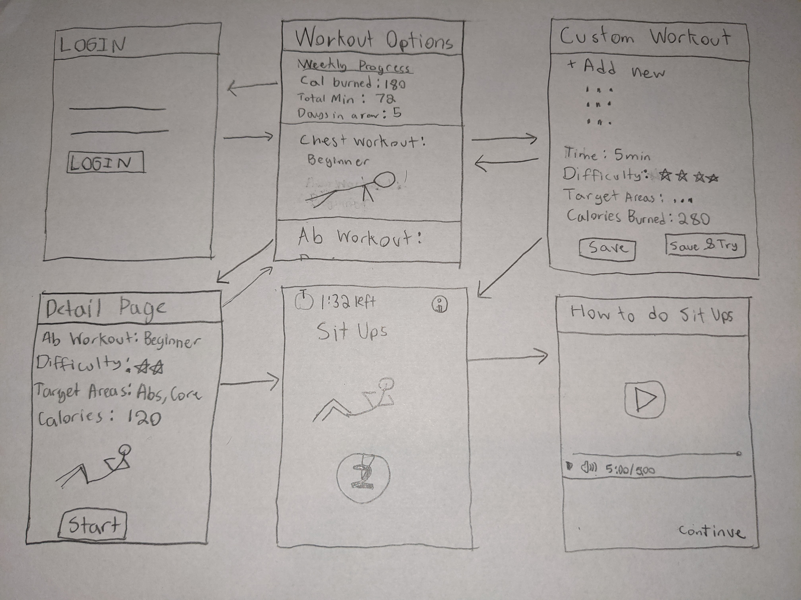

# 2fit

## Table of Contents
1. [Overview](#Overview)
1. [Product Spec](#Product-Spec)
1. [Wireframes](#Wireframes)
2. [Schema](#Schema)

## Overview
### Description
All you need is 2 minutes a day to form a habit. 2fit uses this idea to get users more active without needed a huge gym or expensive equipment. On 2fit, there are full body calisthenic workout plans with an initially set duration of 2 minutes. However, after the initial 2 minutes the user can choose to continue. 

### App Evaluation
- **Category:** Fitness
- **Mobile:** This app would have the same functionality on desktop or mobile
- **Story:** Allows users to stay active anywhere while using behavoiral techniques to promote consistent use.
- **Market:** While social distancing measures are relaxing, many people continue to work virtually. Many people simply do not have access to a gym. Instead they get a great workout in the comfort of their own home. Also there are people who simply do not want to go to the gym becuase they feel judged. 2fit will accommodate a large audience ranging from fitness fiends to beginners 
- **Habit:** Gamification, Weekly reports, and its inherent low commitment makes 2fit the ideal habit forming tool to make people more active
- **Scope:** While it focuses specifically fitness, its range of users spreads to all fitness levels.

## Product Spec

### 1. User Stories (Required and Optional)

**Required Must-have Stories**

* User logs in to the app
* User chooses a workout plan
* User works out for the 2 minute minimum
* User can pause the workout
* Users is asked to continue, User chooses from a variety of options including +1m,+2m,+5m,+10m,custom
* User finishes and closes the app
* User can listen to their favorite playlist using the Spotify API
* Users workout data is scored and compiled for the end-of week report
* User can see their progress in the form of metrics such as weightloss, calories burn, activity time, etc.
* User can add their weight, height, gender to help with calibration
* double click workout skips the details screen

**Optional Nice-to-have Stories**

* information icon which links to a YouTube video on how to do a certain exersize
* Each workout will have metrics such as difficulty rating, target areas, approximate calories burned (based on user info), etc.
* User can add custom workouts

### 2. Screen Archetypes

* Log in page
   * Log in button
   * TextView to insert username and password
* RecyclerView of various fitness plans (Stream / Profile)
   * Selecting a workout will file an intent to a detail page
   * add custom workout button
* Create new custom workout page (Creation)
   * can add various exersized
   * submit changes and update the RecyclerView
* Fitness plan info (Detail)
   * gives basic workout metrics difficulty rating, target areas, approximate calories burned (based on user info), etc.
   * Start button
* Workout screen
   * Timer
   * popup that asks if user wants to add time

### 3. Navigation

**Tab Navigation** (Tab to Screen)

* Settings tab to update profile information, remove user data
* Log out button

**Flow Navigation** (Screen to Screen)

* Log in page
   * RecyclerView Page
* RecyclerView of various fitness plans (Stream / Profile)
   * Creation Page
   * Detail Page
* Create new custom workout page (Creation)
   * RecyclerView Page
* Fitness plan info (Detail)
   * RecyclerView Page
   * Workout screen
* Workout screen
   * RecyclerView Page

# Wireframes

## Schema 

### Models

Workout
| Property | Type | Description |
| -------- | -------- | -------- |
| duration     | int     | Duration of workout|
| calories | int     | Total calories burned    |
| difficulty     | int     | difficulty rating out of 5 |
| target areas     | String     | muscles that are focused on |
| name     | String | name of the workout |
| excersizes     | Array     | Array of all possible excersizes |
| objectId     | int     | id of Workout object  |

User
| Property | Type | Description |
| -------- | -------- | -------- |
| weight     | int     | user weight|
| height | int  | height of user |
| gender | String | gender of user |
| username | String  | username of user |
| password | String | password of user |

Weekly Progress Report
| Property | Type | Description |
| -------- | -------- | -------- |
| user     | pointer -> User| points to its user |
| calories | int | total calories burned in a week |
| duration | int | total time in minutes working out in a week|
| daysInARow | int | consecutive days in a row |

### Networking
- Fitness Plan Screen
    - (Read/GET) Query Workouts

- Add Custom Workout
    - (Create/POST) Create new custom workout

- Workout Screen
    - (Update/PUT) Update values in Weekly Progress
